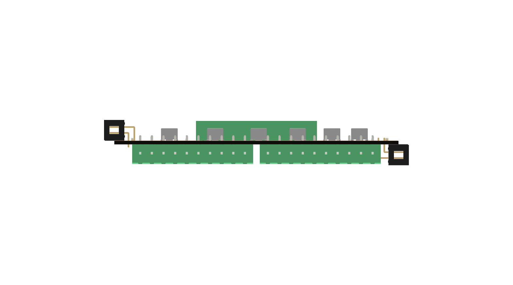

# eurocard mux

 <!-- 3D rendered pretty view -->

INFO INFO

[PCB layout](./DOCUMENTATION/eurocard mux_board_prints.pdf) <!-- PDFs of boards -->
[SCHEMATIC](./DOCUMENTATION/eurocard mux_schematic.pdf) <!-- Schematic PDFs -->

## FRONT

## BACK

## SIDE

# Before major commmits
Remember to run generate_outputs.bat/sh
to update the outputs and pictures.
readmetemplate